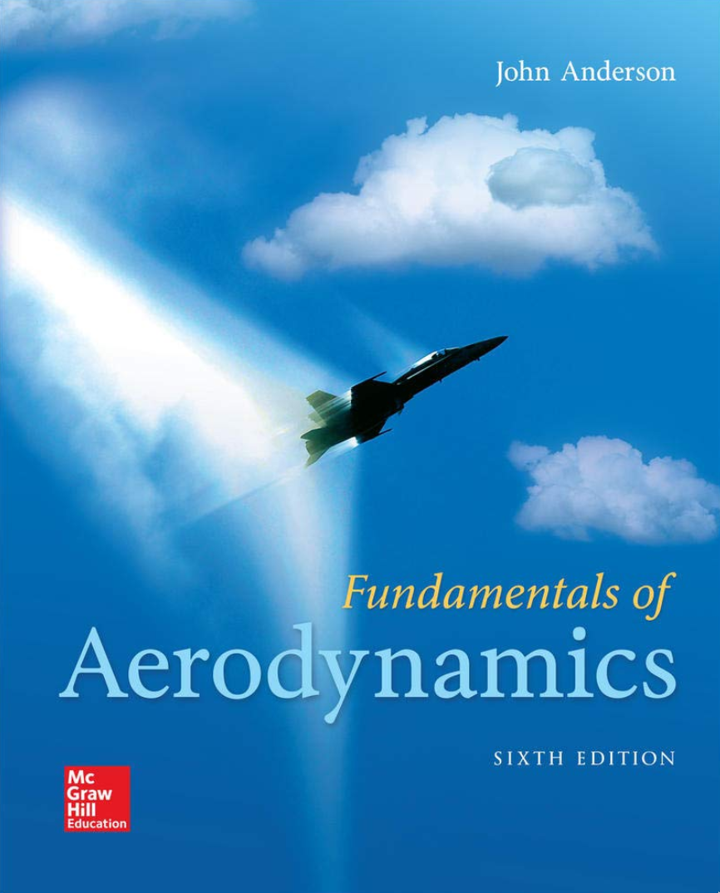
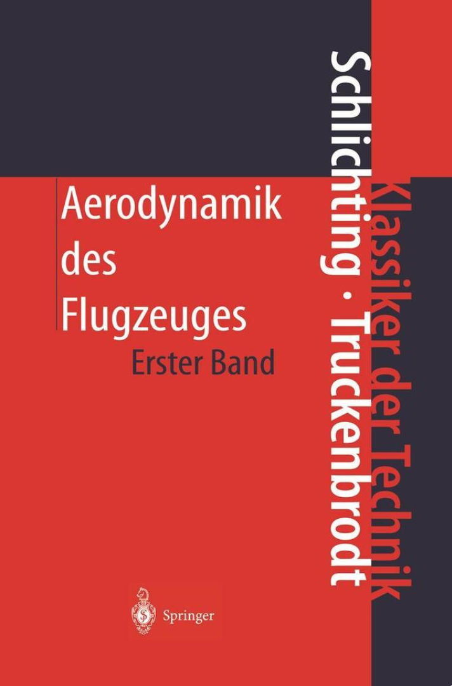
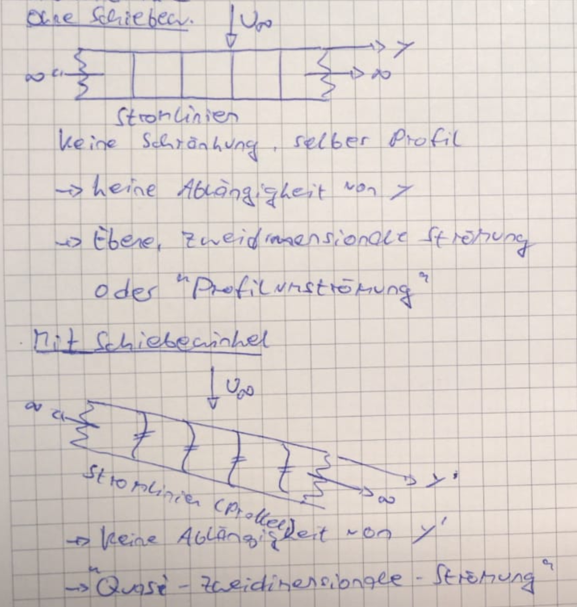
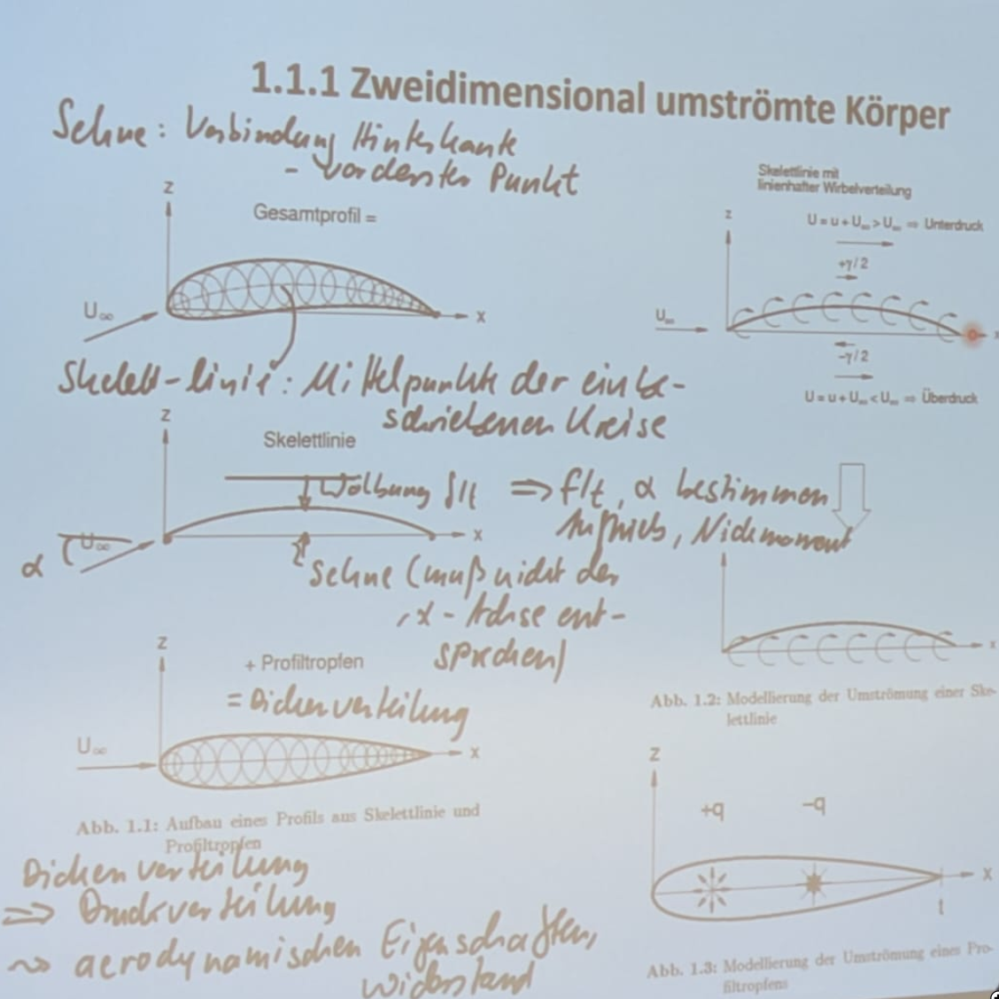

## Einführung

- [Forschungseinrichtung](https://www.project.uni-stuttgart.de/windfors/) für Windenergie, Schwerpunkt Wechselwirkungen der Umgebung mit der Umgebung (Für potenzielle Masterarbeit)
- Handschriftliche Ergänzungen auf Folien auf Ilias
- Übungsaufgaben, Prüfungsaufgaben mit Musterlösung in extra [Ilias Kurs]()
- Aero Programm zur besseren Übung ebenfalls auf [Ilias]()
- Vorlesung in *Präsenz*, *Live* auf DFN und als *Aufzeichnung*
- Online Sprechstunden in DNF sind Montags 13:00 bis 14:00
- Aerodynamik 2 und Profilentwurf als weiterführende Veranstaltungen

### Bücher

<figcaption>Anderson: Fundamentals of Aerodynamics</figcaption>

<figcaption>Schlichtung / Trudenbrodt: Aerodynamik des Flugzeugs</figcaption>

## 1.1.1 Zweidimensional umströmte Körper

<figcaption>Mitschrieb Seite 1</figcaption>

- Profilsehne: Verbindung Hinterkante mit vorderstem Punkt (Muss nicht die x-Achse sein)
- Skelettlinie: Mittelpunkte der einbeschriebenen Kreise
- Profiltropfen: Dickenverteilung
- Wölbung: Höchster Abstand zwischen Skelettlinie und x-Achse

<figcaption>Foto von Mitschrieb auf der Wand, auch auf Ilias</figcaption>

